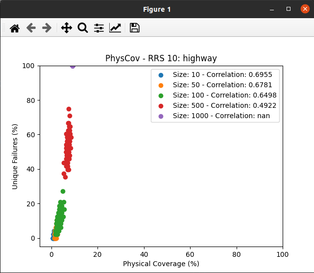
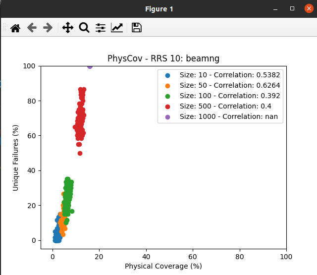
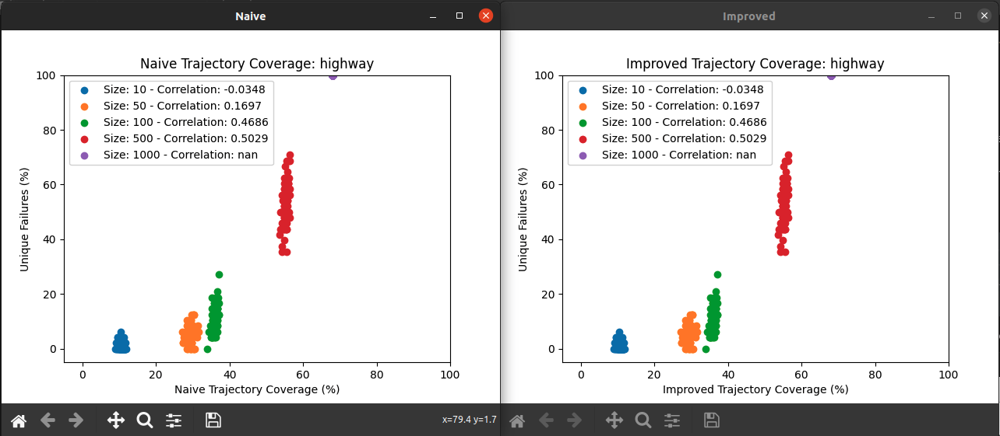
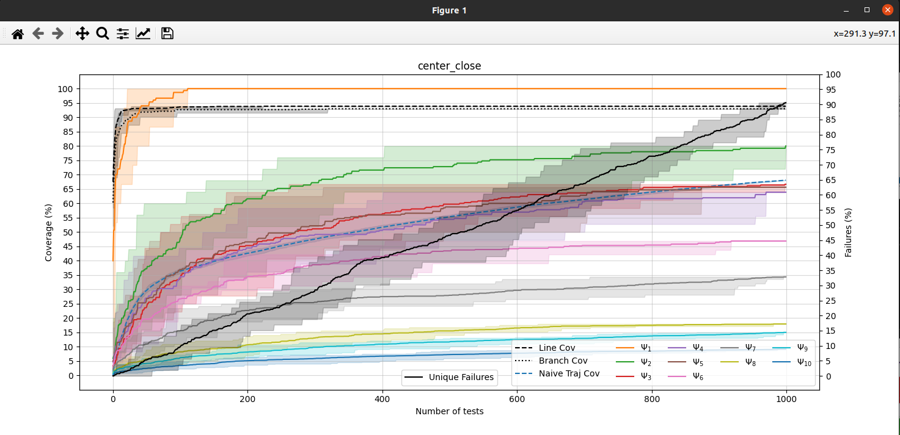
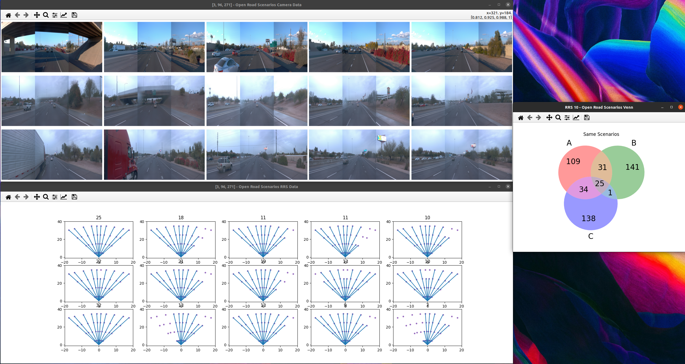
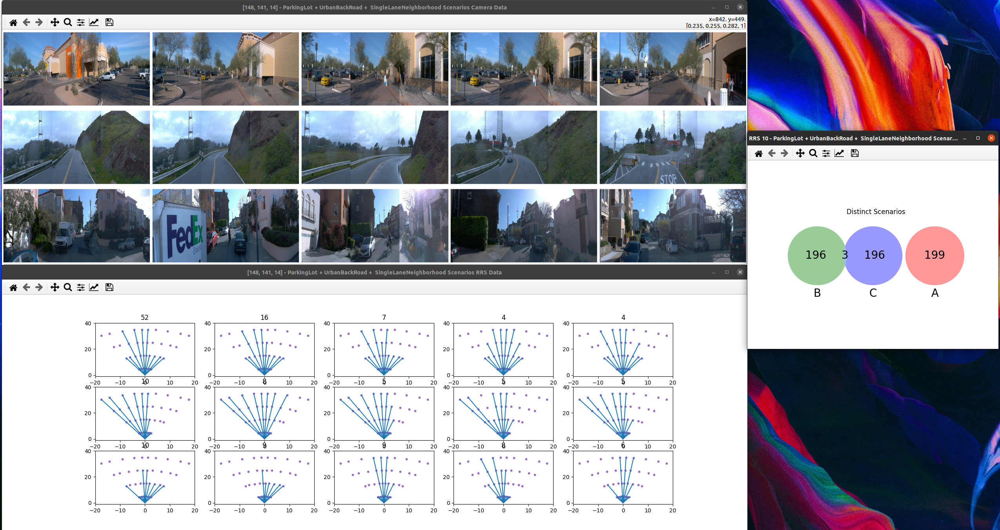
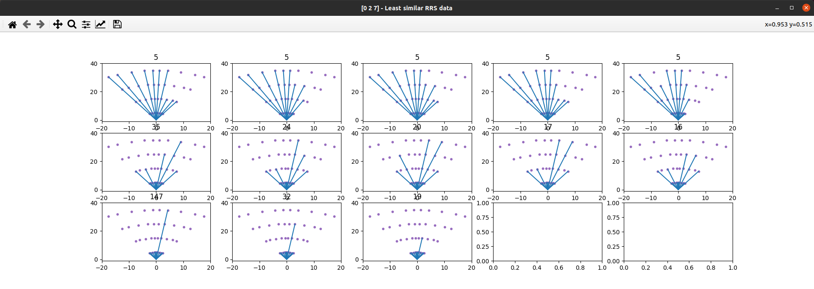

# Coverage Analysis - Subset Dataset

Below we provide information on how to generate the results for each of the different research questions using the subset dataset provided by this repo. 

**Note:** We assume you are in the `./PhysicalCoverage/analysis/research_questions` directory for the following README.

# RQ1

## Question:

How effective is the coverage vector $\Psi$ at grouping equivalent environment inputs such that they cause similar behaviors? And as a follow-up, what is the impact of the $RRS$ parameters on _PhysCov_? 

## Answer:

To answer this question we looked at the correlation between code coverage, trajectory coverage, and Physcov with failures. We also looked how the coverage saturated as we increased the size of the test suite. Finally we looked at how tests can be grouped into equivalence classes. Below we show how we generated these results for the data subset provided to you.

## Code Coverage and Failure Correlation

First we looked at how code coverage correlated with failures. To compute the Peerson R coefficient you can run the following `RQ1_correlation_codecov.py` script. The script has the following parameters
* `number_of_test_suites`: The number of test suites used to compute the correlation
* `number_of_tests`: The number of tests in the dataset
* `distribution`: The data distribution used (We used center_close for our study)
* `scenario`: Either highway or beamng
* `cores`: The number of cores used to do the computation
* `data_path`: The path to the dataset

An example of  using this script is shown below:

```
python3 RQ1_correlation_codecov.py --number_of_test_suites 100 --number_of_tests 1000 --distribution center_close --scenario <scenario> --cores 16 --data_path <full path to folder>/PhysicalCoverage/data_subset
```

If you run this with `scenario` set to `highway` you will get the following results:


If you run this with `scenario` set to `beamng` you will get the following results:


```bash
python3 RQ1_correlation_codecov.py --number_of_test_suites 100 --number_of_tests 1000 --distribution center_close --scenario beamng --cores 120 --data_path /home/carl/Desktop/PhysicalCoverage/data_subset
```

## PhysCov and Failure Correlation

Next we looked at how PhysCov correlated with failures. To compute the Peerson R coefficient you can run the following `RQ1_correlation_codecov.py` script. The script has the following parameters
* `number_of_test_suites`: The number of test suites used to compute the correlation
* `number_of_tests`: The number of tests in the dataset
* `distribution`: The data distribution used (We used center_close for our study)
* `scenario`: Either highway or beamng
* `cores`: The number of cores used to do the computation
* `data_path`: The path to the dataset

An example of  using this script is shown below:

```bash
python3 RQ1_correlation_physcov.py --number_of_test_suites 100 --number_of_tests 1000 --distribution center_close --scenario <scenario> --cores 16 --RRS 10 --data_path <full path to folder>/PhysicalCoverage/data_subset
```

If you run this with `scenario` set to `highway` you will get the following results:



If you run this with `scenario` set to `beamng` you will get the following results:




## Trajectory Coverage and Failure Correlation

We looked at how Trajectory Coverage correlated with failures. To compute the Peerson R coefficient you can run the following `RQ1_correlation_trajcov.py.py` script. The script has the following parameters
* `number_of_test_suites`: The number of test suites used to compute the correlation
* `number_of_tests`: The number of tests in the dataset
* `distribution`: The data distribution used (We used center_close for our study)
* `scenario`: Either highway or beamng
* `cores`: The number of cores used to do the computation
* `data_path`: The path to the dataset

An example of  using this script is shown below:

```bash
python3 RQ1_correlation_trajcov.py --number_of_test_suites 100 --number_of_tests 1000 --distribution center_close --scenario <scenario> --cores 16 --RRS 10 --data_path <full path to folder>//PhysicalCoverage/data_subset
```

If you run this with `scenario` set to `highway` you will get the following results:



If you run this with `scenario` set to `beamng` you will get the following results:

<!--  -->
TODO BeamNG Image

## Coverage as Test Suite Size Increases

We then looked at how the different coverage measures increase as we increase the size of the test suite. To compute this we can use the `RQ1_coverage_vs_failures.py` script. The script has the following parameters:
* `scenario`: Either highway or beamng
* `number_of_tests`: The number of tests in the dataset
* `distribution`: The data distribution used (We used center_close for our study)
* `cores`: The number of cores used to do the computation
* `data_path`: The path to the dataset

An example of  using this script is shown below:

```bash
python3 RQ1_coverage_vs_failures.py --scenario <scenario> --number_of_tests 1000 --distribution center_close --cores 16 --data_path /home/carl/Desktop/PhysicalCoverage/data_subset
```

If you run this with `scenario` set to `highway` you will get the following results:




If you run this with `scenario` set to `beamng` you will get the following results:


## Equivalence Classes

Finally we looked at consistency of the generated the equivalence classes for each metric. To generate these results we can use the `RQ1_signature_test.py` script. The script has the following parameters:
* `scenario`: Either highway or beamng
* `number_of_tests`: The number of tests in the dataset
* `distribution`: The data distribution used (We used center_close for our study)
* `cores`: The number of cores used to do the computation
* `data_path`: The path to the dataset

An example of  using this script is shown below:

```bash
Python3 RQ1_signature_test.py --scenario <scenario> --number_of_tests 1000 --distribution center_close --cores 16 --data_path /home/carl/Desktop/PhysicalCoverage/data_subset
```

If you run this with `scenario` set to `highway` you will get the following results:


If you run this with `scenario` set to `beamng` you will get the following results:


# RQ2

## Question:

How effective is _PhysCov_ at selecting tests that induce unique failures? 

## Answer:

To answer this question we generated 100 test suites between 0\% and 1\% of the datasets size. We generate 3 different types of test suites. Test suites that are selected at random. Test suites that maximize the PhysCov, and test suites the minimize the tests suites.

## Test Selection

To generate the tests suites you can use the `RQ2_test_selection.py` script. This script has the following parameters:
* `number_of_tests`: The number of tests in the dataset
* `distribution`: The data distribution used (We used center_close for our study)
* `RRS_number`: The RRS number used when doing selection to maximize and minimize PhysCov
* `scenario`: Either highway or beamng
* `cores`: The number of cores used to do the computation
* `greedy_sample_size`: The number of tests selected at each iteration to use when selecting for maximum and minimum PhysCov.
* `data_path`: The path to the dataset

An example of  using this script is shown below:

```bash
python3 RQ2_test_selection.py --number_of_tests 1000 --distribution center_close --RRS_number 10 --scenario <scenario> --cores 120 --greedy_sample_size 16 --data_path <full path to folder>/PhysicalCoverage/data_subset
```

If you run this with `scenario` set to `highway` you will get the following results:


If you run this with `scenario` set to `beamng` you will get the following results:


# RQ3

## Question:

Can _PhysCov_ distinguish similar from different real scenarios?

## Answer:

To answer this question, we first computed the total coverage generated by the test suite. Next we looked at how well PhysCov can differentiate between different scenarios using the RRS vectors. First we selected 3 tests that are performed in similar or distinct scenarios and compared how much the RRS vectors overlapped. Next compared all combinations of RRS vectors, and selected the 3 scenarios with the most overlap, and 3 scenarios with the least overlap, and displayed those.

## Total Coverage

To compute the total coverage on the Waymo Open Perception Dataset you can use the `RQ3_compute_total_coverage.py` script. The script has the following parameters:
* `distribution`: The data distribution used (We used center_full for our study)
* `data_path`: The path to the dataset

An example of running the script is show below:

```bash
python3 RQ3_compute_total_coverage.py --distribution center_full --data_path /home/carl/Desktop/PhysicalCoverage/data_subset
```

You will get the following output on your terminal:


## Comparing RRS Overlap of Selected Scenarios

Next we selected 3 similar highway scenarios and 3 distinct scenarios (parking lot, two-lane rural road, single-lane urban road). We then compared their RRS overlap. To do this you can use the `RQ3_real_scenario_compare.py` script. This script has the following parameters:
* `scenario`: The scenario you want to use (We used waymo for our study)
* `distribution`: The data distribution used (We used center_full for our study)
* `number_of_tests`: The number of tests in the dataset (We used 798 for our study)
* `data_path`: The path to the dataset


An example of using the script is shown below:

```
python3 RQ3_real_scenario_compare.py --scenario waymo --number_of_tests 798 --distribution center_full --data_path <full path to folder>/PhysicalCoverage/data_subset
```

You will get the following results showing you the RRS for the similar scenarios. This shows you the camera data from each scenario. The 5 most common RRS in each test. As well as the RRS overlap Venn diagram.



You will also get the following results showing you the RRS for the distinct scenarios. This shows you the camera data from each scenario. The 5 most common RRS in each test. As well as the RRS overlap Venn diagram.



This script is hardcoded to compare indices (similar) [3, 96, 271] and (distinct) [148, 141, 14]. These scenarios can be easily changed by changing lines 328 and 335 in the `RQ3_real_scenario_compare.py` script.

```python
    highway_scenarios = [3, 96, 271]
    ...
    random_scenarios = [148, 141, 14]
```


## Comparing Scenarios of Tests with most and least RRS overlap


Finally we compared all 3 way combinations of RRS. This is a total of 84,376,796 combinations. During this we kept track of the scenarios with the most and least RRS overlap. This can be done using the `RQ3_rrs_scenario_compare.py` script. The script has the following parameters:
* `scenario`: The scenario you want to use (We used waymo for our study)
* `distribution`: The data distribution used (We used center_full for our study)
* `number_of_tests`: The number of tests in the dataset (We used 798 for our study)
* `data_path`: The path to the dataset
* `cores`: The number of cores used to do the computation
* `tracking`: The number of best and worst combinations you want to track (In our study we presented 1 due to space limitations. Here we show the 3.)

An example of using the script is shown below:

```bash
python3 RQ3_rrs_scenario_compare.py --scenario waymo --number_of_tests 798 --distribution center_full --cores 120 --tracking 3 --data_path <full path to folder>/PhysicalCoverage/data_subset
```

This will present several different plots. The first is the `tracking` most similar 3-ways scenarios, as shown below:


It will also show you the RRS values from the most similar 3-way combination. So for example here we can see that each share the same first most similar RRS value


Next it will show you the `tracking` least similar 3-ways scenarios, as shown below. **Note:** The order of these might change. There are many combinations of scenarios which result in `0` overlap. There is no way to order them as they are all equally least similar. Therefor your results will change based on which scenario with no overlap is found first (this is affected by the number of cores used).


It will also show you the RRS values from the most similar 3-way combination. So here we can see there is no overlap



Finally it will show you the Venn diagrams for the scenarios with the most and least overlap.


