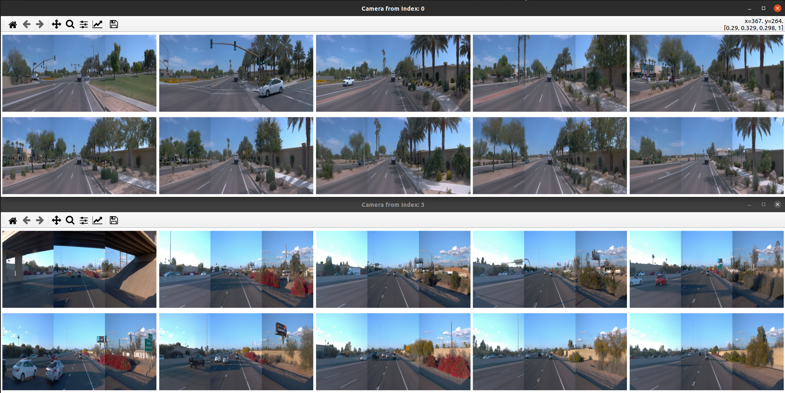

# Waymo

We are using the [Waymo Open Perception Dataset](https://waymo.com/open/). Specifically we are using v1.4.1 released on December 2022. To download these files you need to request permission from Waymo. For more information please refer to our data_subset [README](../../data_subset/README.md).

**data_subset README summary:** We downloaded the `individual_files->training` and then renamed each of the segments as `ScenarioXXX.tfrecord`, where `XXX` is an integer starting from 0 and incrementing for each `tfrecord` file. These files should be placed in `

## Converting Waymo Dataset to Standard Format

**This step requires `.tfrecord` files**

We have provided a script which takes in a `.tfrecord` and outputs both the standard format data required by our pipeline as well as additional data such as the camera data, LiDAR data, and the sensed reach set data.

To do this you can use the script `run_waymo_scenarios.py` which has the following parameters:
* Path to data: The __FULL__ path to the data folder
* Cores: The number of cores used to do this conversion

You can run this script using:
```bash
cd /environments/waymo
python3 run_waymo_scenarios.py --data_path <full path to folder>/PhysicalCoverage/data_subset --cores 5
```

If all was successful you should get the following output. **Note:** in this example we had only downloaded 5 `.tfrecord` files. If you were running the entire study, this should say "Found 798 scenario files".


The additional data can be found in the `output/waymo/random_tests/physical_coverage/additional_data` folder. The first 5 scenarios have also been provided for you in the `data_subset` folder. Inside the `additional_data folder` you will find the camera data which is shown below:


The raw LiDAR data (note this only has the LiDAR points which are in front of the vehicle) which is shown below:


Finally it also generates the sensed reachable set which is shown below:


## Viewing the data 

Sometimes you might want to view camera data from one or many scenarios. Rather than viewing each of the `.png` images in the `additional_data` folder, you can use the `inspect_camera.py` script. This script has the following parameters:
* Path to data: The __FULL__ path to the data folder
* Index: The scenario index as a comma separated list

An example of using this script to view the camera data from scenario 0 and scenario 3 would be:

```bash
cd /environments/waymo
python3 inspect_camera --data_path <full path to folder>/PhysicalCoverage/data_subset --index "0, 3"
```

If all was successful you will be left with the following output:

